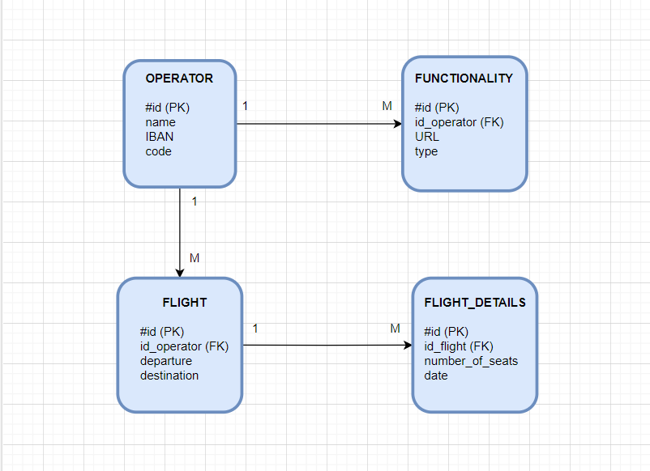

- **Admin**:
  ***Manage Airline Operators***
    - Register airline operators (e.g., Lufthansa, TAROM, etc.) with their IBAN for payment.
    - Register API for each operator (each operator will define an API for a specific function; for example, for flight
      search 'http://lufthansa.com/searchFlight').
    - Connect with operator user and perform operations: register destinations (e.g., Bucharest - Timisoara flight
      operated by TAROM) and the number of available seats on the platform.
    - Read Kafka topic and update the number of available seats with the value from the received message.
    - Send a message back to the booking service with the status (ok/nok) for each update request.

### Domain model:



### API's for admin-service

#### Examples of request/response:

#### OPERATOR

###### For add operator:

#### POST :http://localhost:8080/operator/add

```
{
    "code":"ROT",
    "name":"TAROM",
    "iban":"RO53RNCB0082005630560001"
}
```

Response:

````
{
    "id": "66014ba0795e9d6bda686019",
    "code": "ROT",
    "name": "TAROM",
    "iban": "RO53RNCB0082005630560001"
}
````

#### For GET all Operators: GET http://localhost:8080/operator/all

Response:

```
[
    {
        "id": "66014ba0795e9d6bda686019",
        "code": "ROT",
        "name": "TAROM",
        "iban": "RO53RNCB0082005630560001"
    },
    {
        "id": "66014e15795e9d6bda68601a",
        "code": "WZZ",
        "name": "Wizz Air",
        "iban": "RO45BTRLRONCRT0425283901"
    },
    {
        "id": "66014ea5795e9d6bda68601b",
        "code": "THY",
        "name": "Turkish Airlines",
        "iban": " RO19BACX0000001124019000"
    }
]
```

#### For UPDATE Iban operator : Put http://localhost:8080/operator/modify-iban/id

```
{
   "iban":" RO19BACX0000001124019001"
}
```

Response:

```
{
    "id": "66014ba0795e9d6bda686019",
    "code": "ROT",
    "name": "TAROM",
    "iban": " RO19BACX0000001124019001"
}
```

#### Get operator by id http://localhost:8080/operator/66014ba0795e9d6bda686019

Response:

```
{
    "id": "66014ba0795e9d6bda686019",
    "code": "ROT",
    "name": "Tarom",
    "iban": "RO53RNCB0082005630560001"
}
```

#### Get operator by name http://localhost:8080/operator/name/Tarom

Response:

``` 
{
    "id": "66014ba0795e9d6bda686019",
    "code": "ROT",
    "name": "Tarom",
    "iban": "RO53RNCB0082005630560001"
}
```

#### Delete operator by id  DELETE http://localhost:8080/operator/660661b9069b7e64e70a00ed

### FLIGHT

#### Add flight: POST http://localhost:8080/flights/add

Body:

``` 
{
    "operatorId":"660583f82900e209ee0fbe69",
    "departure":"New York",
    "destination":"London"
}
```

#### Get all flights: http://localhost:8080/flights/all

Response:

``` 
[
    {
        "id": "6602756acc4f882dcac177a8",
        "operatorId": "⁠66014ba0795e9d6bda686019",
        "departure": "Bucharest",
        "destination": "Sevilla"
    },
    {
        "id": "66056ba0683acd001abdd47a",
        "operatorId": "66014ba0795e9d6bda686019",
        "departure": "New York",
        "destination": "London"
    },
    {
        "id": "660585bc2900e209ee0fbe6a",
        "operatorId": "660583f82900e209ee0fbe69",
        "departure": "New York",
        "destination": "London"
    }
]

```

#### Get flight by id http://localhost:8080/flights/66056ba0683acd001abdd47a

Response:

``` 
{
    "id": "66056ba0683acd001abdd47a",
    "operatorId": "66014ba0795e9d6bda686019",
    "departure": "New York",
    "destination": "London"
}
```

#### Get flight by departure & destination & date:

GET http://localhost:8080/flights/filter?departure=New York&destination=London&date=2024-04-02
Response:

``` 
[
    {
        "id": "66056ba0683acd001abdd47a",
        "operatorId": "66014ba0795e9d6bda686019",
        "departure": "New York",
        "destination": "London"
    },
    {
        "id": "660585bc2900e209ee0fbe6a",
        "operatorId": "660583f82900e209ee0fbe69",
        "departure": "New York",
        "destination": "London"
    }
]
```

#### Delete flight by id : http://localhost:8080/flights/delete/6606641c069b7e64e70a00ee

### FLIGHT_DETAILS

##### Post flight details : http://localhost:8080/flight-details/add

Request:

``` 
{
    "flightId":"660585bc2900e209ee0fbe6a",
    "numberOfSeats":88,
    "date":"2024-04-02"
}
```

#### Get all flight details: http://localhost:8080/flight-details/all

Response:

``` 
[
    {
        "id": "66056bff683acd001abdd47b",
        "flightId": "66056ba0683acd001abdd47a",
        "numberOfSeats": 88,
        "date": "2024-04-02"
    },
    {
        "id": "660586ae2900e209ee0fbe6b",
        "flightId": "660585bc2900e209ee0fbe6a",
        "numberOfSeats": 88,
        "date": "2024-04-02"
    }
]
```

#### Get flight_details by id : http://localhost:8080/flight-details/66056bff683acd001abdd47b

Response:

```
{
    "id": "66056bff683acd001abdd47b",
    "flightId": "66056ba0683acd001abdd47a",
    "numberOfSeats": 88,
    "date": "2024-04-02"
}

```

### FUNCTIONALITIES

#### Add functionality : POST http://localhost:8080/functionalities/add

Request:

``` 
{
    "URL":"http://lufthansa.com/flight-search",
    "type":"FLIGHT_SEARCH",
    "operatorId":"660583f82900e209ee0fbe69"
}
```

#### Get all functionalities: http://localhost:8080/functionalities

#### Get all by operator id : http://localhost:8080/functionalities/operator/660583f82900e209ee0fbe69

#### Get by id : http://localhost:8080/functionalities/6605877f2900e209ee0fbe6c

#### Update functionality: http://localhost:8080/functionalities/update/660150c5344cea1094e80870

Body:

``` 
{
    "URL":"http://lufthansa.com/flight-search",
    "type":"FLIGHT_SEARCH"
}
```

#### Get operator by id http://localhost:8080/operator/66014ba0795e9d6bda686019

Response:

```
{
    "id": "66014ba0795e9d6bda686019",
    "code": "ROT",
    "name": "Tarom",
    "iban": "RO53RNCB0082005630560001"
}
```

#### Get operator by name http://localhost:8080/operator/name/Tarom

Response:

``` 
{
    "id": "66014ba0795e9d6bda686019",
    "code": "ROT",
    "name": "Tarom",
    "iban": "RO53RNCB0082005630560001"
}
```

#### Delete operator by id  DELETE http://localhost:8080/operator/660661b9069b7e64e70a00ed

### FLIGHT

#### Add flight: POST http://localhost:8080/flights/add

Body:

``` 
{
    "operatorId":"660583f82900e209ee0fbe69",
    "departure":"New York",
    "destination":"London"
}
```

#### Get all flights: http://localhost:8080/flights/all

Response:

``` 
[
    {
        "id": "6602756acc4f882dcac177a8",
        "operatorId": "⁠66014ba0795e9d6bda686019",
        "departure": "Bucharest",
        "destination": "Sevilla"
    },
    {
        "id": "66056ba0683acd001abdd47a",
        "operatorId": "66014ba0795e9d6bda686019",
        "departure": "New York",
        "destination": "London"
    },
    {
        "id": "660585bc2900e209ee0fbe6a",
        "operatorId": "660583f82900e209ee0fbe69",
        "departure": "New York",
        "destination": "London"
    }
]

```

#### Get flight by id http://localhost:8080/flights/66056ba0683acd001abdd47a

Response:

``` 
{
    "id": "66056ba0683acd001abdd47a",
    "operatorId": "66014ba0795e9d6bda686019",
    "departure": "New York",
    "destination": "London"
}
```

#### Get flight by departure & destination & date:

GET http://localhost:8080/flights/filter?departure=New York&destination=London&date=2024-04-02
Response:

``` 
[
    {
        "id": "66056ba0683acd001abdd47a",
        "operatorId": "66014ba0795e9d6bda686019",
        "departure": "New York",
        "destination": "London"
    },
    {
        "id": "660585bc2900e209ee0fbe6a",
        "operatorId": "660583f82900e209ee0fbe69",
        "departure": "New York",
        "destination": "London"
    }
]
```

#### Delete flight by id : http://localhost:8080/flights/delete/6606641c069b7e64e70a00ee

### FLIGHT_DETAILS

##### Post flight details : http://localhost:8080/flight-details/add

Request:

``` 
{
    "flightId":"660585bc2900e209ee0fbe6a",
    "numberOfSeats":88,
    "date":"2024-04-02"
}
```

#### Get all flight details: http://localhost:8080/flight-details/all

Response:

``` 
[
    {
        "id": "66056bff683acd001abdd47b",
        "flightId": "66056ba0683acd001abdd47a",
        "numberOfSeats": 88,
        "date": "2024-04-02"
    },
    {
        "id": "660586ae2900e209ee0fbe6b",
        "flightId": "660585bc2900e209ee0fbe6a",
        "numberOfSeats": 88,
        "date": "2024-04-02"
    }
]
```

#### Get flight_details by id : http://localhost:8080/flight-details/66056bff683acd001abdd47b

Response:

```
{
    "id": "66056bff683acd001abdd47b",
    "flightId": "66056ba0683acd001abdd47a",
    "numberOfSeats": 88,
    "date": "2024-04-02"
}

```

### FUNCTIONALITIES

#### Add functionality : POST http://localhost:8080/functionalities/add

Request:

``` 
{
    "URL":"http://lufthansa.com/flight-search",
    "type":"FLIGHT_SEARCH",
    "operatorId":"660583f82900e209ee0fbe69"
}
```

#### Get all functionalities: http://localhost:8080/functionalities

#### Get all by operator id : http://localhost:8080/functionalities/operator/660583f82900e209ee0fbe69

#### Get by id : http://localhost:8080/functionalities/6605877f2900e209ee0fbe6c

#### Update functionality: http://localhost:8080/functionalities/update/660150c5344cea1094e80870

Body:

``` 
{
    "URL":"http://lufthansa.com/flight-search",
    "type":"FLIGHT_SEARCH"
}
```

